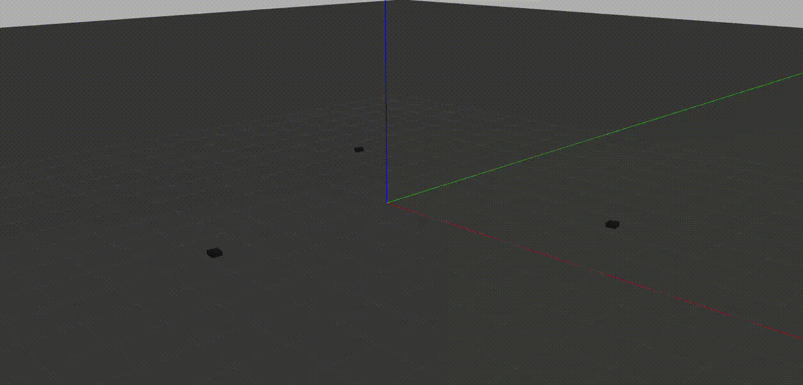

# UGV Formation (ROS 2 Multi-Agent Consensus Control)

UGV Formation is a ROS 2 package for simulating and controlling a decentralized fleet of **WaveShare UGV02 (Unmanned Ground Vehicles)** using the **Gazebo** 3D simulator. The primary objective of this project is to coordinate the movements of three independent robots to form and maintain a synchronized circular trajectory using a distributed consensus-based control algorithm.

## Features

* **Decentralized Consensus Control**
  Robots communicate their states to dynamically adjust velocities and maintain a desired circular formation.

* **Kinematic Steering**
  Tracks a fixed **5-meter radius** using a unicycle kinematic model for smooth and stable motion.

* **Phase-Based Spacing**
  Maintains equal **120° angular separation** between neighboring robots using phase-difference calculations with wrap-around handling.

* **Automated Data Logging**
  Records odometry, control commands, and tracking errors to CSV files for post-simulation analysis.

The controller decouples **linear velocity (`v`)** for formation spacing from **angular velocity (`w`)** for path tracking, resulting in stable circular motion while reducing formation drift.

Compared to a basic cyclic pursuit controller, this implementation includes additional kinematic corrections for improved stability, smoother convergence, and consistent radius tracking.

---

## Simulation

The animation below demonstrates the decentralized consensus controller coordinating three WaveShare UGV02 robots into a stable circular formation while maintaining equal angular spacing.

<p align="center">
  
</p>

---

# Installation

## Prerequisites

Install the following before building the project:

* Ubuntu 22.04
* ROS 2 Humble
* Gazebo
* Python 3

---

## Workspace Setup

Create a ROS 2 workspace and clone the repository into the `src` directory.

```bash
mkdir -p ~/ros2_ws/src
cd ~/ros2_ws/src

git clone https://github.com/infyier/ros2-consensus-formation-control.git
```

---

## Building

Build the package using `colcon`.

```bash
cd ~/ros2_ws

colcon build --packages-select ugv_formation
```

---

## Running the Simulation

Source the workspace and launch the formation controller.

```bash
source install/setup.bash

ros2 launch ugv_formation formation.launch.py
```

The launch file:

* Spawns three UGV02 robots
* Dynamically namespaces every robot
* Starts one decentralized controller per robot
* Uses staggered startup timers to reduce initialization load

---

# Expected Behavior

After launching:

1. Three UGV02 robots spawn near the origin.
2. Each robot aligns itself with the tangent of the target circle.
3. Robots independently adjust their linear velocities to achieve equal **120° phase separation**.
4. Once converged, the robots maintain a stable circular orbit indefinitely.

---

# Data Logging

Each controller automatically creates an individual CSV log file during execution.

### Log Location

```text
~/ugv_formation_logs/
```

Example:

```text
ugv1_20260627_101530.csv
ugv2_20260627_101530.csv
ugv3_20260627_101530.csv
```

---

## Logged Metrics

| Metric               | Description                                  |
| -------------------- | -------------------------------------------- |
| `time_s`             | Simulation timestamp                         |
| `x`, `y`, `yaw_rad`  | Robot pose obtained from odometry            |
| `distance_to_leader` | Euclidean distance to the pursued robot      |
| `v_cmd_ms`           | Published linear velocity                    |
| `w_cmd_rads`         | Published angular velocity                   |
| `heading_error`      | Tangential heading tracking error            |
| `distance_error`     | Radial distance error from the target circle |

---

# Project Structure

```text
ros2-consensus-formation-control
│
├── src
│   └── ugv_formation
│       ├── launch
│       ├── resource
│       ├── test
│       ├── urdf
│       ├── ugv_formation
│       │   ├── __init__.py
│       │   └── consensus_node.py
│       ├── package.xml
│       ├── setup.py
│       └── setup.cfg
│
├── README.md
└── .gitignore
```

---

# Technologies Used

* ROS 2 Humble
* Gazebo
* Python
* Differential Drive Kinematics
* Multi-Agent Consensus Control
* Cyclic Pursuit Formation
* CSV Data Logging

---

# Future Improvements

* Dynamic obstacle avoidance
* Support for larger robot swarms
* Formation switching
* Leader election
* RViz visualization
* Performance analysis tools

---

# License

This project is released under the MIT License.
